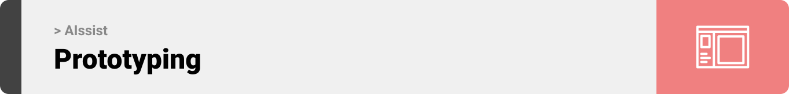
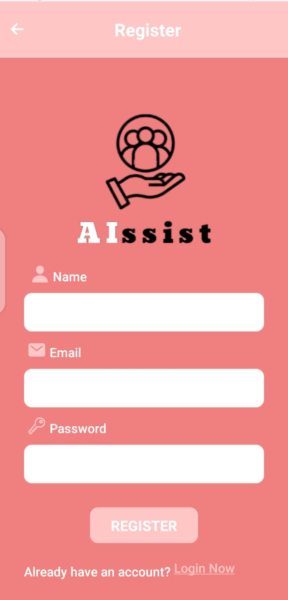

<br><br>

<!-- project philosophy -->


> A mobile application for assisting parents of children with special needs using AI.
>
> 

### User Stories
- As a new user, I want to be able to create an account with my personal information, such as name, email, and password, so that I can access the features of the application.
- As a returning user, I want to be able to log in to my account using my email and password, so that I can access my saved information and preferences.
- As a user, I want to be able to join a community where I can share my experience and connect with other parents who are going through similar situations.
- As a user, I want to be able to ask any question related to my child's condition and receive relevant and accurate information. This will help me better understand my child's condition and make informed decisions about their care.
- As a user, I want to be able to view a list of specialists in my area who can assist me and my child, and be able to book appointments online or in person.
- As a user, I want to be able to submit a form with information about my child's situation and behaviors and receive personalized recommendations for activities, games, and lessons that I can practice with my child.
- As a user, I want to be able to provide feedback on the activities recommended to me by the application, so that the system can improve its recommendations and provide better support for me and my child.

### Admin Stories
-  As an admin, I want to be able to securely log into the admin panel using my unique email and password, in order to access and manage the application's features.
-  As an admin, I want to be able to manage the user accounts and profiles.
-  As an admin, I want to be able to monitor and moderate the community discussion, including flagging inappropriate content and addressing any conflicts or issues that arise.
-  As an admin, I want to be able to update and maintain the list of specialists in the domain, including adding new specialists and updating their information and availability.
<br><br>

<!-- Prototyping -->


> We designed AIssist using wireframes and mockups, iterating on the design until we reached the ideal layout for easy navigation and a seamless user experience.

### Wireframes
| Login screen  | Register screen |  Landing screen |
| ---| ---| ---|
|  |  |  |

### Mockups
| Register screen  | Login Screen | Questions Screen |
| ---| ---| ---|
|  |  |  |
| Activities screen  | Feedbacks Screen | Feed Screen |
| ---| ---| ---|
|  |  |  |

<br><br>

<!-- Implementation -->


> Using the wireframes and mockups as a guide, we implemented the AIssist app with the following features:

### User Screens (Mobile)
| Launch screen  | Login screen | Register screen | Specialists screen |
| ---| ---| ---| ---|
|  |  |  |  |
| Feed screen  | Comments Screen | Questions Screen | Activities1 Screen |
|  |  |  |  |
| Activities2 screen  | Activities2 Screen | Feedbacks1 Screen | Feedbacks2 Screen |
|  |  |  |  |

### Admin Screens (Web)
| Login screen  | Users Accounts Screen |  View Specialists Screen |
| ---| ---| ---|
|  |  |  |
| Add Specialist screen  | Community Moderation Screen | Community Moderation Screen |
|  |  |  |
| Logout Screen  
|   
<br><br>

<!-- Tech stack -->


###  AIssist is built using the following technologies:

-This project uses the [react-native](https://reactnative.dev/) framework for users mobile application. It is a JavaScript framework for writing real, natively rendering mobile applications for iOS and Android.
-Also this project uses React.JS along with Electron.JS for the admin panel.React is a JavaScript library for building user interfaces as a single-page application, and it allows the creation of reusable UI components.And For Designing admin we use Tailwind. Tailwind CSS is a framework for quickly building and customizing applications .
- This project uses for backend Laravel web application framework.Laravel is a PHP web framework intended for the development of web applications following the model–view–controller (MVC) architectural pattern.
-For database this project uses MySQL database. MySQL is an open-source relational database management system (RDBMS) that is based on Structured Query Language (SQL). RDBMS is a software or service used to create and manage databases based on a relational model.

<br><br>

<!-- How to run -->


> To set up AIssist locally, follow these steps:

### Prerequisites

- Install NPM from: [NPM](https://nodejs.org/en/download)

- Install composer from: [Composer](https://getcomposer.org/download)

- Database server: Any Apache HTTP Server, MariaDB database server, recommended [XAMPP](https://www.apachefriends.org)

### Installation

_Below is an example of how you can instruct your audience on installing and setting up your app. This template doesn't rely on any external dependencies or services._

1. Get a free API Key at [https://example.com](https://example.com)
2. Clone the repo
   ```sh
   git clone https://https://github.com/mirvat-brkt/AIssist
   ```
3. Install NPM packages
   ```sh
   npm install
   ```
4. Enter your API in `config.js`
   ```js
   const API_KEY = 'ENTER YOUR API';
   ```

Now, you should be able to run AIssist locally and explore its features.
